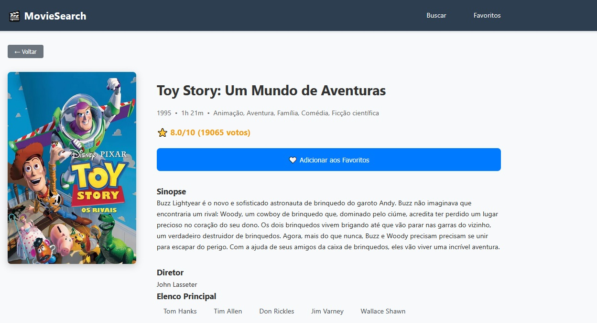
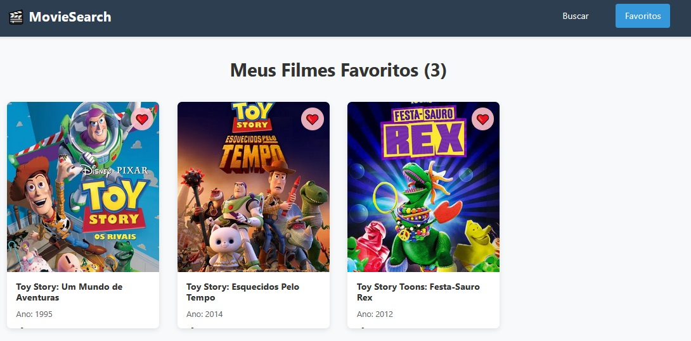

# 🎬 MovieSearch - Buscador de Filmes


Uma aplicação React moderna para buscar filmes, ver detalhes e gerenciar sua lista de favoritos usando a API do The Movie Database (TMDB).


# ✨ Funcionalidades
## 🎯 Funcionalidades Principais
- 🔍 Busca Avançada: Pesquise filmes por título com resultados em tempo real

- 📄 Paginação: Navegue por múltiplas páginas de resultados

- 🎭 Detalhes Completos: Visualize informações detalhadas dos filmes

- ❤️ Lista de Favoritos: Adicione/remova filmes da sua lista pessoal

- 💾 Persistência: Seus favoritos são salvos localmente no navegador

- 🎨 Interface & UX
- Design Responsivo: Funciona perfeitamente em desktop, tablet e mobile

- Loading States: Indicadores de carregamento durante requisições

- Tratamento de Erros: Mensagens amigáveis para erros e estados vazios

- Filtro de Qualidade: Mostra apenas filmes com informações completas

- Animações Suaves: Transições e hover effects elegantes

# 🛠️ Tecnologias Utilizadas
## Frontend
- React 18 - Framework principal

- React Router DOM - Roteamento e navegação

- Axios - Cliente HTTP para APIs

- CSS3 - Estilização com Flexbox e Grid

## APIs
- The Movie Database (TMDB) - Dados de filmes e imagens

- LocalStorage API - Persistência local de dados

## Ferramentas
- Create React App - Boilerplate inicial

- npm - Gerenciador de pacotes

- Git - Controle de versão

# 📦 Instalação
## Pré-requisitos
- Node.js 16+ instalado

- npm ou yarn

- Chave API do TMDB

## Passo a Passo

1.Clone o repositório:
```
git clone https://github.com/renanmello/moviedatabase_pure_react/tree/master
cd moviedatabase_pure_react
```
2. Install dependencies:
```
npm install
```
3. Configure a API KEY:
```
Obtenha uma chave API gratuita em TMDB

Crie um arquivo .env na raiz do projeto e configure a chave conforme o documento envExample

```
4. Execute a aplicação:
```
npm start
```
5. Acesse a aplicação:
```
Abra seu navegador em: http://localhost:3000
```

# ScreenShots:






# 🚀 Como Usar
## Buscar Filmes
- Digite o nome de um filme na barra de busca

- Clique em "Buscar" ou pressione Enter

- Navegue pelos resultados usando a paginação

## Ver Detalhes
- Clique em qualquer card de filme

- Visualize informações completas como:

- Sinopse detalhada

- Elenco principal

- Diretor

- Avaliação dos usuários

- Duração e gêneros

## Gerenciar Favoritos
- Clique no ícone de coração ❤️ em qualquer filme

- Acesse sua lista em "Favoritos" no menu

- Seus favoritos são salvos automaticamente

## Navegação
- Use o menu superior para alternar entre Busca e Favoritos

- Use o botão "Voltar" para retornar à lista anterior

# 🏗️ Estrutura do Projeto
```
src/
├── components/          # Componentes reutilizáveis
│   ├── Header/         # Cabeçalho com navegação
│   ├── MovieCard/      # Card individual de filme
│   ├── Pagination/     # Controle de paginação
│   ├── Loading/        # Indicador de carregamento
│   └── ErrorMessage/   # Mensagens de erro
├── pages/              # Páginas principais
│   ├── Search/         # Página de busca
│   ├── MovieDetails/   # Página de detalhes
│   └── Favorites/      # Lista de favoritos
├── services/           # Serviços externos
│   ├── api.js          # Integração com TMDB API
│   └── localStorage.js # Gerenciamento de favoritos
├── utils/              # Utilitários
│   └── validation.js   # Validação de dados
├── styles/             # Estilos globais
└── hooks/              # Hooks personalizados
```

# ⚙️ Configuração da API
Obtendo a Chave TMDB

1. Acesse The Movie Database

2. Crie uma conta gratuita

3. Vá em Settings > API

4. Solicite uma API Key para desenvolvimento

5. Copie a chave gerada

# 📄 Licença
Este projeto está sob a licença MIT. 
